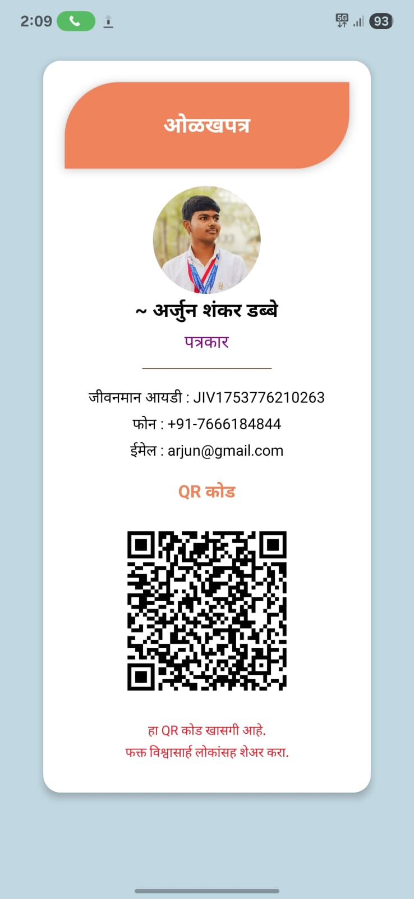

# 📱 Jivanman-News-Application

**Jivanman** is a modern local news and community app that provides real-time updates, village information, and important announcements in a clean and easy-to-use interface.

Stay connected with your community, festivals, local events, and more — all in one app.

---

## 🚀 Features

- 📰 Real-time local news updates  
- 📍 News based on your current location  
- 📣 Government schemes, alerts, and announcements  
- 🔍 Search functionality  
- 📅 Event & festival calendar  
- 📱 Clean and responsive UI for all Android devices  

---

## 🛠️ Tech Stack

- Android (Java/XML)  
- Firebase (Realtime Database)  
- NewsAPI  
- GitHub  

---

## 📸 Screenshots

### 🆔 Jivanman ID Card Example

*This is a sample ID card layout used in the Jivanman application.*

---

